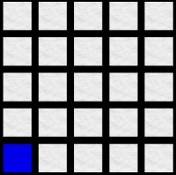
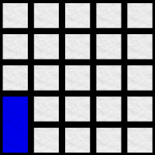
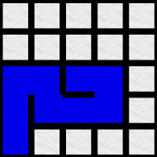
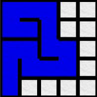
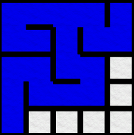
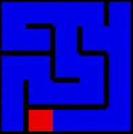

This page is going to be dedicated to walking through the development of my 2D Penguin Labyrinth game I made for school. This post will help anyone interested in game development to understand the process. It will also prove helpful for anyone looking for a maze generation implementation in Unity. When I started this project I was surprised how little reference there is out there for this particular problem.

In this post I will cover:
1. Algorithm Development
2. Unity Implementation
3. Feature Development(player characteristics, enemy characteristics, etc.)
4. Extra Stuff

Here is a screenshot of a level from the game(this is taken with the black removed in order to show the full maze)

Game Available Here
===================

If you are interested in seeing the mostly finished version, it is available for free <a href="https://clydefrog04.github.io/Downloads" target="_blank">here</a>. Keep in mind there are still some minor bugs, but the game is playable.

Basic Idea for Game
===================

The idea for this game came from something I found online. The game was called Imprint, but I don't think it ever got finished. I can't seem to find a reference to it anymore, but if I find it I will share it here. The basic idea is a maze game that starts with the maze totally blacked out. The player simply has to explore the maze to light it up. As the player moves, a 3x3 grid around the player will light up whatever cells are not currently lit. Those cells will remain lit throughout the rest of the level. 

The player encounters one enemy that moves randomly throughout the maze. The player can shoot this enemy to gain more time and get rid of the enemy from the maze. 

The player's goal is to find the blue fish that spawns randomly in the maze. Once the player finds the goal fish, the next maze is automatically generated. Each new maze is one cell bigger than the last. The first maze starts at 5x5, the next being 6x6 and so on.

Algorithm Development
=====================

I spent a lot of time researching different maze generation algorithms. There are plently out there and if you're interested in reading about them, <a href="https://en.wikipedia.org/wiki/Maze_generation_algorithm" target="_blank">here is a wiki article</a> that goes over a few of them in detail. This was a very useful post for me while I was trying to figure out what I wanted to use. I looked online and found lots of different implementations of all these different algorithms, but kept coming back to one basic idea.

I ended up using my own implementation of <a href="https://en.wikipedia.org/wiki/Prim%27s_algorithm" target="_blank">Prim's algorithm</a>. My implementation is a depth-first generation. You can find implementations all over the internet. In order to figure out how to implement it, I wrote out on paper exactly what I needed it to do. This proved useful because now I was able to visualize what each step of the algorithm need to accomplish.

Each maze is made up of a grid of maze cells. Each cell is an object with a few properties. Each cell has four walls: North, South, East and West. The other property each cell has is a boolean isVisited, to tell the code if the cell should be modified or not. We start with a grid of univisted cells. In unity this looks like this:  

After the grid is generated, the code then picks a cell at random, we'll call this cell the guideCell. I included some code so I can control whether I want the guidCell to be randomly picked or picked following some rules. However, for this post let's just assume it is randomly picked, though it makes no difference. We'll also say that, for this example, the guideCell happens to be the bottom left cell, or the cell at (0,0). When a cell is visited, I mark it blue just so I can see visually how the cells are being visited. So after the first cell is visited we get:  

Now, we check all of the current cell's(our guideCell) neighbors. In this case, our guideCell has two valid neighbors, the cell at (0,1) and the cell at (1,0). Those are the cells directly above and directly to the right. In order for a cell to be valid, it has to be directly adjacent to the guidCell, and itself be unvisited. Once we know what cells are valid cells, we can pick randomly between all of them, and that cell will become the new guideCell, and the previous guideCell will be marked as visited. As a side note, each new guideCell will only have, at max, 3 valid neighbors to choose from. Only the initial guideCell can have 4 valid neighbors. Before we can move on and assign a new guideCell, there is one more thing we have to do. We have to keep track of which direction we move so we can remove the walls between those two cells. For this example, our next guideCell will be the cell directly north of the current guideCell. The steps to properly move to the next guide cell are these:
1. Mark the current guideCell as visited
2. Decide what direction the next cell is, and remove that wall in that direction from the current cell
3. Assign the next cell as the guideCell
4. Remove the wall from the direction we just came from

These steps are really simple if you think about what they are doing. The only confusing part of these steps is 4. It's not that complicated but is something important to keep in mind. If we move north from our guideCell, that guideCell will have it's north wall removed. Then we set the cell to the north as the new guideCell, and remove it's south wall since we just came from the cell to the south. So for our example, we are moving north. After all of these steps are executed, we get this:  

Now that we understand how it works, let's travel a bit faster now. From our curent cell let's follow this path: North, East, South, East, East, North, West. Each time following the above steps to make sure each cell's properties are properly modified. We end up with this partial travel:  

This works great up until we hit a dead end. That is, a cell that doesn't have any valid neighbors. From our current guideCell, if we follow this path: North, North, West, West, South, East, we will end up with a dead end:  

From here it looks like there is nothing to do but end the generation. This is where using a Stack comes in handy. A Stack is a data structure, similar to a List. Stacks simulate a stack in real life. If you have a pile of objects, let's say a pile of hockey pucks, you can stack them on top of each other. When you want to remove one, you have to remove the one on top, which would also be the most recently placed puck. We can use this idea and data structure to solve our dead end problem. We'll call our stack pathHistory. We add more more step to our cell movement steps. Now each time we assign a new guideCell, we will also push that cell to our pathHistory stack. 

This means that when we get to a dead end, we can pop the current guideCell off our stack, and check if the new cell at the top of the stack has any valid neighbors. If it does, we check how many it has, pick one, and repeat all of the steps we've been following to generate a path. If the next cell has no valid neighbors, we will continue this pop/check structure until we either find a cell with valid neighbors, or our pathHistory stack runs out of cells. If our pathHistory stack runs out of cells, our generation is actually complete and we have a fully generated maze. Using our current maze with this idea, we pop cells until we run into the cell at (2,4) which is the cell in the middle of the top row. This only has one valid neighbor, so we will go East from here. From the next cell we will follow this path: South, East, North. This gives us another dead end:  

Rinse and repeat from here, pop the stack until we find a valid neighbor, then continue path generation. I've finished the generation, and marked the final guideCell in red so you can see where we end up:  

just adding words

