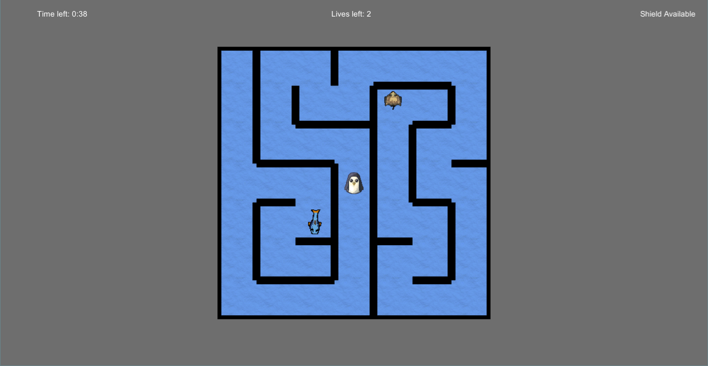

This page is going to be dedicated to walking through the development of my 2D Penguin Labyrinth game I made this past semester. 

In this post I will cover:
1. Algorithm Development
2. Unity Implementation
3. Feature Development(player characteristics, enemy characteristics, etc.)
4. Extra Stuff

Here is a screenshot of a level from the game(this is taken with the black removed in order to show full maze)

Basic idea for game
===================

The idea I had for this game came from something I found online. I can't seem to find a reference to it anymore, but if I find it I will share it here. The basic idea is a maze game that starts with the maze totally blacked out. The player simply has to explore the maze to light it up. As the player moves, a 3x3 grid around the player will light up whatever cells are not currently lit. Those cells will remain lit throughout the rest of the level. 

The player encounters one enemy that moves randomly throughout the maze. The player can shoot this enemy to gain more time and get rid of the enemy from the maze. 

The player's goal is to find the blue fish that spawns randomly in the maze. Once the player finds the goal fish, the next maze is automatically generated. Each new maze is one cell bigger than the last. The first maze starts at 5x5, the next being 6x6 and so on.

Algorithm development
=====================

I ended up using my own implementation of [Prim's algorithm](https://en.wikipedia.org/wiki/Prim%27s_algorithm).

this is <a href="https://en.wikipedia.org/wiki/Prim%27s_algorithm" target="_blank">prim's</a> algorithm.
this is an [example link. Nothing more.](www.google.com).
this is an [example link with title](www.google.com "With a title").
