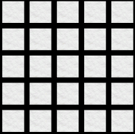

This page is going to be dedicated to walking through the development of my 2D Penguin Labyrinth game I made this past semester. 

In this post I will cover:
1. Algorithm Development
2. Unity Implementation
3. Feature Development(player characteristics, enemy characteristics, etc.)
4. Extra Stuff

Here is a screenshot of a level from the game(this is taken with the black removed in order to show full maze)

Game Available Here
===================

If you are interested in seeing the final product, it is available for free <a href="https://github.com/ClydeFrog04/regan.github.io" target="_blank">here</a>.

Basic Idea for Game
===================

The idea I had for this game came from something I found online. The game was called Imprint, but I don't think it ever got finished. I can't seem to find a reference to it anymore, but if I find it I will share it here. The basic idea is a maze game that starts with the maze totally blacked out. The player simply has to explore the maze to light it up. As the player moves, a 3x3 grid around the player will light up whatever cells are not currently lit. Those cells will remain lit throughout the rest of the level. 

The player encounters one enemy that moves randomly throughout the maze. The player can shoot this enemy to gain more time and get rid of the enemy from the maze. 

The player's goal is to find the blue fish that spawns randomly in the maze. Once the player finds the goal fish, the next maze is automatically generated. Each new maze is one cell bigger than the last. The first maze starts at 5x5, the next being 6x6 and so on.

Algorithm Development
=====================

I spent a lot of time researching different maze generation algorithms. There are plently out there and if you're interested in reading about them, <a href="https://en.wikipedia.org/wiki/Maze_generation_algorithm" target="_blank">here is a wiki article</a> that goes over a few of them in detail. This was a very useful post for me while I was trying to figure out what I wanted to use. I looked online and found lots of different implementations of all these different algorithms, but kept coming back to one basic idea.

I ended up using my own implementation of <a href="https://en.wikipedia.org/wiki/Prim%27s_algorithm" target="_blank">Prim's algorithm</a>. My implementation is a depth-first generation. You can find implementations all over the internet. In order to figure out how to implement it, I wrote out on paper exactly what I needed it to do. This proved useful because now I was able to visualize what each step of the algorithm need to accomplish.

Each maze is made up of a grid of maze cells. Each cell is an object with a few properties. Each cell has four walls: North, South, East and West. The other property each cell has is a boolean isVisited, to tell the code if the cell should be modified or not. We start with a grid of univisted cells. In unity this looks like this:  

After the grid is generated, the code then picks a cell at random, we'll call this cell the guideCell. I included some code so I can control whether I want the guidCell to be randomly picked or picked following some rules. However, for this post let's just assume it is randomly picked, though it makes no difference. We'll also say that, for this example, the guideCell happens to be the bottom left cell, or the cell at (0,0). When a cell is visited, I mark it blue just so I can see visually how the cells are being visited. So after the first cell is visited we get:  

